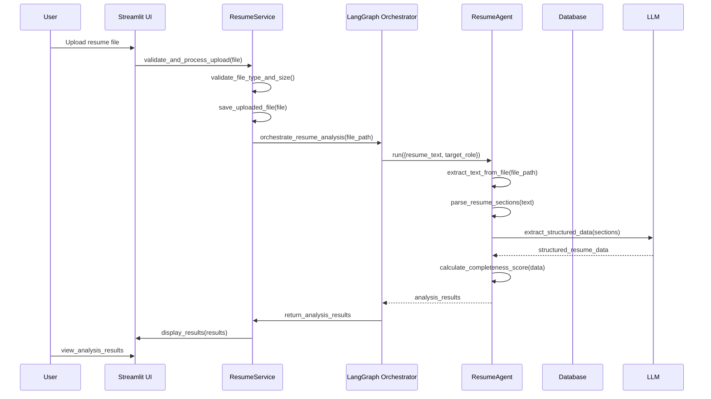
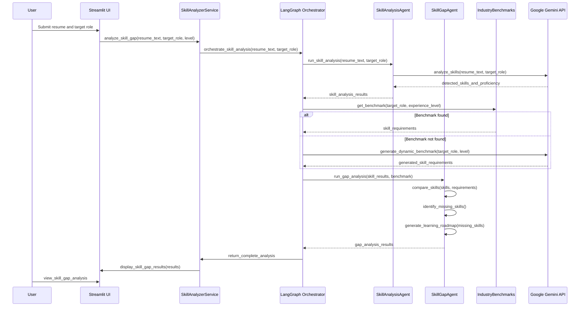
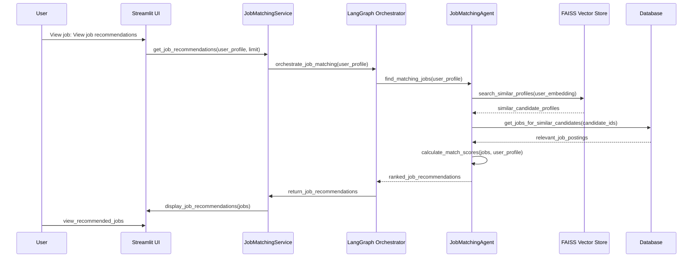

# TalentMind AI - Software Architecture Documentation

## 1. Introduction

This document describes the software architecture of the TalentMind AI platform, a Multi-Agent Generative AI and Agentic AI powered Recruitment Intelligence and Career Guidance Platform.

## 2. Architectural Goals

The architecture is designed to achieve the following goals:

1. **Modularity**: Separate concerns into distinct, loosely coupled modules
2. **Scalability**: Support horizontal scaling to handle increased load
3. **Maintainability**: Clear separation of concerns for easy updates and debugging
4. **Extensibility**: Easy addition of new agents and features
5. **Performance**: Efficient processing with minimal latency
6. **Security**: Protection against common vulnerabilities and unauthorized access
7. **Reliability**: Fault tolerance and graceful degradation
8. **Testability**: Components that can be easily unit and integration tested

## 3. Architectural Style

TalentMind AI employs a **hybrid architectural style** combining:

1. **Microservices-inspired modularity** - Though initially deployed as a monolith for simplicity, the codebase is structured as independent services that can be separated later
2. **Agent-based architecture** - Specialized AI agents handle specific domains of expertise
3. **Event-driven communication** - Agents communicate through a central orchestrator (LangGraph)
4. **Layered architecture** - Separation of presentation, business logic, and data layers

## 4. High-Level Architecture

```
┌─────────────────────────────────────────────────────────────────┐
│                        Presentation Layer                       │
│                            (Streamlit UI)                       │
└─────────────────────┬───────────────────────────────────────────┘
                      │
┌─────────────────────▼───────────────────────────────────────────┐
│                    API Gateway / Request Handler                │
│              (Handles routing, auth, validation - planned)      │
└─────────────────────┬───────────────────────────────────────────┘
                      │
┌─────────────────────▼───────────────────────────────────────────┐
│                     Service Layer                               │
│  (Orchestrates agents, handles business logic, manages state)   │
└─────────────────────┬───────────────────────────────────────────┘
                      │
┌─────────────────────▼───────────────────────────────────────────┐
│                     Agent Layer (LangGraph Orchestrator)        │
│  ┌─────────────┐  ┌─────────────┐  ┌─────────────┐  ┌───────────┐ │
│  │ Resume Agent│  │ Skill Agent │  │ ATS Agent   │  │ ...       │ │
│  └─────────────┘  └─────────────┘  └─────────────┘  └───────────┘ │
│           ▲              ▲              ▲                 ▲         │
│           │              │              │                 │         │
│           └──────────────┴──────────────┴─────────────────┘         │
│                              Orchestrator                           │
│                             (LangGraph)                             │
└─────────────────────┬───────────────────────────────────────────┘
                      │
┌─────────────────────▼───────────────────────────────────────────┐
│                        Data Layer                               │
│  ┌─────────────┐  ┌─────────────┐  ┌─────────────┐  ┌───────────┐ │
│  │  Database   │  │ Vector Store│  │  File Store │  │  Cache    │ │
│  │ (SQLite/    │  │   (FAISS)   │  │ (Uploads/   │  │ (Redis)   │ │
│  │  PostgreSQL)│  │             │  │  Reports)   │  │           │ │
│  └─────────────┘  └─────────────┘  └─────────────┘  └───────────┘ │
└─────────────────────────────────────────────────────────────────┘
```

## 5. Component Architecture

### 5.1 Presentation Layer
**Technology**: Streamlit

**Components**:
- `app/ui/pages/` - Individual page modules (Upload, Analysis, Interview, etc.)
- `app/ui/components/` - Reusable UI components (planned for future enhancement)

**Responsibilities**:
- Render user interface
- Handle user input
- Display results and feedback
- Manage session state
- Provide navigation between features

**Communication**:
- Calls service layer methods to perform business logic
- Receives data transfer objects (DTOs) from services
- Displays loading states, error messages, and success notifications

### 5.2 Service Layer
**Technology**: Pure Python classes

**Components**:
- `app/services/resume_service.py` - Orchestrates resume processing
- `app/services/skill_analyzer.py` - Orchestrates skill analysis and gap detection
- `app/services/ats_analyzer.py` - Orchestrates ATS analysis
- `app/services/interview_service.py` - Orchestrates interview preparation
- `app/services/job_matching_service.py` - Orchestrates job matching

**Responsibilities**:
- Coordinate between multiple agents to accomplish complex tasks
- Validate and preprocess input data
- Handle business rules and workflow logic
- Transform data between agent format and service/API format
- Manage error handling and recovery
- Provide a clean API for the presentation layer

**Communication**:
- Receives requests from presentation layer
- Invokes appropriate agents through the orchestrator
- Aggregates results from multiple agents
- Returns structured responses to presentation layer

### 5.3 Agent Layer
**Technology**: Custom agent classes extending BaseAgent, orchestrated by LangGraph

**Components**:
- `app/agents/base_agent.py` - Abstract base class for all agents
- `app/agents/resume_agent.py` - Resume parsing and information extraction
- `app/agents/skill_agent.py` - Skill detection and analysis
- `app/agents/skill_gap_agent.py` - Skill gap analysis and roadmap generation
- `app/agents/ats_agent.py` - ATS compatibility analysis
- `app/agents/interview_agent.py` - Interview question generation and preparation
- `app/agents/job_matching_agent.py` - Job matching and career recommendations
- `app/agents/recommendation_agent.py` - Career and learning recommendations
- `app/agents/ranking_agent.py` - Candidate scoring and ranking
- `app/agents/reflection_agent.py` - Workflow validation and improvement suggestions
- `app/agents/risk_agent.py` - Risk analysis and mitigation strategies
- `app/agents/memory_agent.py` - Storage and retrieval of user history
- `app/agents/pdf_report_agent.py` - Professional report generation
- `app/agents/dashboard_agent.py` - Analytics and visualization data preparation
- `app/orchestrator/langgraph_router.py` - Workflow orchestration and state management

**Responsibilities**:
- Perform specialized domain-specific tasks
- Communicate with LLMs (Google Gemini) for reasoning and generation
- Access data stores when needed
- Return structured results to the orchestrator
- Handle agent-specific errors and retries

**Communication**:
- Receive requests from orchestrator via standardized input format
- Return results in standardized output format
- Communicate with external services (LLM API, database, file storage)
- Use shared utilities for common functions

### 5.4 Data Layer
**Technologies**:
- **Primary Database**: SQLite (development), PostgreSQL (production)
- **Vector Store**: FAISS for similarity search
- **File System**: Local storage for uploads, processed files, reports
- **Cache**: Redis (planned for future enhancement)

**Components**:
- `app/database/connection.py` - Database connection management
- `app/database/models.py` - SQLAlchemy ORM models
- `app/database/repositories/` - Data access layer implementations
- `app/utils/vector_store.py` - FAISS wrapper for similarity search (planned)

**Responsibilities**:
- Persist and retrieve structured data (user profiles, analyses, reports)
- Store and search vector embeddings for skill matching
- Manage file uploads and processed documents
- Provide caching layer for frequently accessed data
- Handle database migrations and schema evolution

**Communication**:
- Used by agents and services for data persistence
- Accessed via repository pattern for abstraction
- Connection pooling for efficient resource utilization

### 5.5 Cross-Cutting Concerns
These are implemented as utility modules that span multiple layers:

#### 5.5.1 Core Utilities
- `app/core/settings.py` - Configuration management (Pydantic Settings)
- `app/core/constants.py` - Application-wide constants and enums
- `app/core/logging_config.py` - Centralized logging configuration
- `app/core/exceptions.py` - Custom exception hierarchy

#### 5.5.2 Utility Modules
- `app/utils/validators.py` - Input validation functions
- `app/utils/industry_benchmarks.py` - Skill requirement data and lookup
- `app/utils/roadmap_generator.py` - Learning path creation algorithms
- `app/utils/prompt_templates.py` - LLM prompt engineering utilities
- `app/utils/file_processor.py` - Document parsing utilities

## 6. Data Flow

### 6.1 Resume Upload and Analysis Flow


### 6.2 Skill Gap Analysis Flow


### 6.3 Job Matching Flow


## 7. Component Details

### 7.1 Base Agent (`app/agents/base_agent.py`)
**Purpose**: Provides common functionality for all specialized agents

**Key Features**:
- Standardized lifecycle methods (`_log_start`, `_log_complete`, `_log_error`)
- LLM interaction wrapper (`_call_llm`) with retry logic
- JSON response parsing with fallback handling (`_parse_json_response`)
- Agent identification and metadata
- Error handling and reporting patterns

**Interfaces**:
- Input: Standardized dictionary with task-specific keys
- Output: Standardized dictionary with `success`, `error`, and result-specific keys
- Communication: Through orchestrator using method calls

### 7.2 Resume Agent (`app/agents/resume_agent.py`)
**Purpose**: Extract and structure information from resume documents

**Capabilities**:
- Text extraction from PDF, DOCX, and TXT files
- Section identification (experience, education, skills, projects)
- Entity extraction (name, contact info, dates, organizations)
- Structured data representation of resume content
- Confidence scoring for extracted information

**Input**:
```python
{
    "resume_text": str,           # Extracted text from resume file
    "parsed_resume": dict,        # Optional pre-parsed resume data
    "target_role": str           # Target job role for context
}
```

**Output**:
```python
{
    "success": bool,
    "error": str or None,
    "parsed_resume": dict,        # Structured resume data
    "candidate_name": str,
    "skills_count": int,
    "education_count": int,
    "experience_count": int,
    "projects_count": int,
    "contact_info": dict,
    "summary": str
}
```

### 7.3 Skill Analysis Agent (`app/agents/skill_agent.py`)
**Purpose**: Detect, classify, and score skills from resume content

**Capabilities**:
- Named entity recognition for technical skills
- Skill categorization (programming languages, frameworks, tools, soft skills)
- Proficiency level inference from context and experience
- Skill relevance scoring to target role
- Industry-standard skill taxonomy mapping

**Input**:
```python
{
    "resume_text": str,
    "parsed_resume": dict,
    "target_role": str
}
```

**Output**:
```python
{
    "success": bool,
    "error": str or None,
    "detected_skills": list[str],
    "skill_categories": dict[str, list[str]],  # category -> skills
    "proficiency_summary": dict[str, str],     # skill -> level
    "industry_comparison": dict,               # benchmark comparison
    "skill_scores": dict[str, float],          # skill -> proficiency score
    "top_skills": list[str],                   # most relevant skills
    "skill_gaps": list[str],                   # missing important skills
    "recommendations": list[str],              # skill improvement suggestions
    "total_skills_count": int
}
```

### 7.4 Skill Gap Agent (`app/agents/skill_gap_agent.py`)
**Purpose**: Identify skill gaps and generate learning roadmaps

**Capabilities**:
- Compare candidate skills against role requirements
- Identify missing critical skills
- Assess proficiency gaps for existing skills
- Generate personalized learning recommendations
- Create structured learning roadmaps with timelines
- Suggest resources (courses, certifications, projects)

**Input**:
```python
{
    "skill_analysis_result": dict,   # Output from Skill Analysis Agent
    "target_role": str,
    "experience_level": str,
    "job_description": str,
    "industry": str
}
```

**Output**:
```python
{
    "success": bool,
    "error": str or None,
    "match_percentage": float,       # Overall fit for target role
    "missing_skills": list[str],     # Completely absent skills
    "proficiency_gaps": dict[str, str],  # skill -> current vs required level
    "learning_roadmap": list[dict],  # Structured learning plan
    "recommended_courses": list[dict], # Specific course suggestions
    "estimated_timeline": str,       # Time to close gaps
    "priority_skills": list[str],    # Most important skills to learn first
    "alternative_roles": list[str],  # Similar roles with better fit
    "development_suggestions": list[str] # General growth advice
}
```

### 7.5 ATS Agent (`app/agents/ats_agent.py`)
**Purpose**: Analyze resume compatibility with Applicant Tracking Systems

**Capabilities**:
- ATS formatting compliance check
- Keyword optimization analysis
- Section heading standardization
- File format and parsing compatibility
- ATS-specific improvement suggestions

**Input**:
```python
{
    "resume_text": str,
    "parsed_resume": dict,
    "target_role": str
}
```

**Output**:
```python
{
    "success": bool,
    "error": str or None,
    "ats_score": float,              # 0-100 compatibility score
    "format_issues": list[str],      # Formatting problems
    "keyword_matches": dict[str, int], # keyword -> count
    "missing_keywords": list[str],   # Important keywords not found
    "section_issues": list[str],     # Problems with resume sections
    "file_format_issues": list[str], # DOC/PDF compatibility problems
    "suggestions": list[str],        # Specific improvements
    "optimized_resume": str          # ATS-optimized version (preview)
}
```

### 7.6 Interview Agent (`app/agents/interview_agent.py`)
**Purpose**: Generate interview questions and preparation materials

**Capabilities**:
- Technical question generation based on skills
- Behavioral question selection
- Situational/judgment question creation
- Domain-specific question tailoring
- Answer guidelines and evaluation criteria
- Mock interview simulation framework

**Input**:
```python
{
    "resume_text": str,
    "parsed_resume": dict,
    "target_role": str,
    "interview_type": str,           # technical, behavioral, situational
    "difficulty_level": str          # easy, medium, hard
}
```

**Output**:
```python
{
    "success": bool,
    "error": str or None,
    "questions": list[dict],         # array of question objects
    "question_categories": dict,     # type -> questions
    "answer_guidelines": dict,       # question_id -> answer tips
    "evaluation_criteria": dict,     # what interviewers look for
    "follow_up_questions": dict,     # potential follow-ups
    "difficulty_distribution": dict, # easy/medium/hard counts
    "estimated_duration": int        # minutes
}
```

### 7.7 Job Matching Agent (`app/agents/job_matching_agent.py`)
**Purpose**: Match candidate profiles to suitable job opportunities

**Capabilities**:
- Skill-based similarity matching
- Experience level compatibility
- Location and preference filtering
- Company culture and values alignment
- Career trajectory analysis
- Salary and compensation matching

**Input**:
```python
{
    "candidate_profile": dict,       # Parsed resume data
    "skills": list[str],
    "experience_years": int,
    "preferences": dict,             # location, salary, remote, etc.
    "job_market_data": list[dict]    # Available job postings
}
```

**Output**:
```python
{
    "success": bool,
    "error": str or None,
    "matches": list[dict],           # Job match objects with scores
    "match_categories": dict,        # exact, close, stretch matches
    "skill_match_analysis": dict,    # detailed skill compatibility
    "experience_gap_analysis": dict, # over/under qualification
    "location_match": bool,          # location preference match
    "salary_expectation_match": bool,# compensation alignment
    "recommended_applications": list, # prioritized job applications
    "market_insights": dict          # demand, growth, trends for role
}
```

### 7.8 Recommendation Agent (`app/agents/recommendation_agent.py`)
**Purpose**: Provide career and learning recommendations

**Capabilities**:
- Career path suggestions based on skills and interests
- Learning resource recommendations (courses, certifications)
- Skill development prioritization
- Industry trend analysis
- Professional networking suggestions
- Personal branding advice

**Input**:
```python
{
    "candidate_profile": dict,
    "skills_analysis": dict,
    "gap_analysis": dict,
    "career_goals": dict,            # user aspirations
    "market_data": dict              # industry trends
}
```

**Output**:
```python
{
    "success": bool,
    "error": str or None,
    "career_paths": list[dict],      # Suggested career trajectories
    "learning_recommendations": list[dict], # Courses and certifications
    "skill_development_plan": dict,  # Prioritized skill building
    "networking_suggestions": list,  # Professional connections to pursue
    "personal_branding_tips": list,  # Resume, LinkedIn, portfolio advice
    "industry_insights": dict,       # Trends and opportunities
    "action_items": list[dict]       # Immediate next steps
}
```

### 7.9 Ranking Agent (`app/agents/ranking_agent.py`)
**Purpose**: Score and rank candidates based on multiple criteria

**Capabilities**:
- Multi-criteria scoring model
- Weighted factor analysis
- Comparative ranking against peer groups
- Percentile calculation
- Strengths and weaknesses identification
- Hiring recommendation generation

**Input**:
```python
{
    "candidates": list[dict],        # Multiple candidate profiles
    "job_requirements": dict,        # Target role specifications
    "weights": dict,                 # Factor importance weights
    "benchmark_data": dict           # Industry/competitor norms
}
```

**Output**:
```python
{
    "success": bool,
    "error": str or None,
    "ranked_candidates": list[dict], # Candidates with scores and ranks
    "score_breakdown": dict,         # Detailed scoring per candidate
    "percentile_rankings": dict,     # How candidates compare to peers
    "strengths_weaknesses": dict,    # Key strengths and areas for improvement
    "hiring_recommendation": dict,   # Overall suitability assessment
    "comparison_insights": dict      # How candidates compare to each other
}
```

### 7.10 Reflection Agent (`app/agents/reflection_agent.py`)
**Purpose**: Validate agent outputs and suggest improvements

**Capabilities**:
- Cross-agent consistency checking
- Logical flow validation
- Completeness assessment
- Accuracy verification against source data
- Recommendation quality evaluation
- Workflow optimization suggestions

**Input:
{
    "agent_outputs": dict,    

**Input**:
```python:
{
    "workflow_state": dict,          # Current state of multi-agent workflow
    "agent_results": dict,           # Outputs from all participating agents
    "original_input": dict,          # Initial user request/data
    "validation_rules": dict         # Domain-specific validation criteria
}
```

**Output**:
```json
{
    "success": bool,
    "error": str or None,
    "consistency_check": dict,       # Cross-validation between agent outputs
    "completeness_assessment": dict, # Missing information analysis
    "accuracy_indicators": dict,     # Confidence scores for results
    "improvement_suggestions": list, # Specific ways to enhance outputs
    "confidence_score": float,       # Overall reliability of workflow
    "validation_summary": str        # Human-readable validation report
}
```

### 7.11 Risk Analysis Agent (`app/agents/risk_agent.py`)
**Purpose**: Identify and assess risks related to career decisions and skill gaps

**Capabilities**:
- Skill obsolescence risk assessment
- Market demand volatility analysis
- Career transition risk evaluation
- Skill gap impact quantification
- Mitigation strategy recommendations
- Risk monitoring suggestions

**Input**:
```json
{
    "skill_analysis": dict,
    "gap_analysis": dict,
    "market_trends": dict,
    "career_goals": dict,
    "economic_indicators": dict
}
```

**Output**:
```json
{
    "success": bool,
    "error": str or None,
    "skill_obsolescence_risks": list, # At-risk skills with timelines
    "market_volatility_assessment": dict, # Demand stability by skill/role
    "transition_risks": dict,         # Risks associated with career changes
    "skill_gap_impact": dict,         # Consequences of unaddressed gaps
    "mitigation_strategies": list,    # Risk reduction approaches
    "monitoring_recommendations": list, # What to watch and when
    "risk_score": float,              # Overall risk assessment (0-100)
    "risk_categories": dict           # Breakdown by risk type
}
```

### 7.12 Memory Agent (`app/agents/memory_agent.py`)
**Purpose**: Store and retrieve user history for personalized experiences

**Capabilities**:
- User profile and preference storage
- Historical analysis and recommendation tracking
- Skill development progress monitoring
- Application and outcome tracking
- Personalized insight generation
- Data privacy and consent management

**Input**:
```json
{
    "user_id": str,
    "operation": str,                # store, retrieve, update, delete
    "data_type": str,                # profile, analysis, recommendation, etc.
    "data": dict,                    # Data to store or update criteria
    "query_params": dict             # Filters for retrieval operations
}
```

**Output**:
```json
{
    "success": bool,
    "error": str or None,
    "data": dict or list,            # Retrieved data or operation confirmation
    "metadata": dict,                # Timestamps, version info, etc.
    "cache_hit": bool,               # Whether data was served from cache
    "storage_location": str          # Where data is persisted
}
```

### 7.13 PDF Report Agent (`app/agents/pdf_report_agent.py`)
**Purpose**: Generate professional, formatted reports of analysis results

**Capabilities**:
- Multi-page PDF report generation
- Template-based report customization
- Chart and graph embedding
- Professional styling and branding
- Section organization and formatting
- Secure document generation

**Input**:
```json
{
    "report_type": str,              # resume_analysis, skill_gap, career_guidance, etc.
    "user_data": dict,               # Profile and preference information
    "analysis_results": dict,        # Outputs from various agents
    "visualizations": dict,          # Charts and graphs to include
    "template_options": dict,        # Styling and layout preferences
    "output_options": dict           # Format, branding, distribution preferences
}
```

**Output**:
```json
{
    "success": bool,
    "error": str or None,
    "report_path": str,              # File system path to generated PDF
    "report_url": str,               # Accessible URL if applicable
    "generation_time": float,        # Seconds to generate report
    "page_count": int,               # Number of pages in report
    "file_size": int,                # Bytes in generated file
    "preview_available": bool        # Whether preview/thumbnails generated
}
```

### 7.14 Dashboard Agent (`app/agents/dashboard_agent.py`)
**Purpose**: Prepare data and visualizations for analytics dashboard

**Capabilities**:
- Key metric calculation and aggregation
- Trend analysis over time
- Comparative analytics (peer, industry, historical)
- Data visualization preparation
- Interactive dashboard component generation
- Export functionality setup

**Input**:
```json
{
    "user_id": str,
    "time_period": str,              # last_month, quarter, year, all_time
    "metrics_of_interest": list,     # Specific metrics to calculate
    "comparison_baseline": str,      # self, peer_group, industry_average
    "visualization_types": list,     # charts, graphs, tables needed
    "detail_level": str              # summary, detailed, drill_down
}
```

**Output**:
```json
{
    "success": bool,
    "error": str or None,
    "dashboard_data": dict,          # Structured data for dashboard components
    "visualizations": dict,          # Chart configurations and data
    "key_metrics": dict,             # Important performance indicators
    "trends": dict,                  # Directional changes over time
    "comparisons": dict,             # How user compares to benchmarks
    "insights": list,                # Actionable observations from data
    "refresh_interval": int          # Recommended update frequency in seconds
}
```

### 7.15 LangGraph Orchestrator (`app/orchestrator/langgraph_router.py`)
**Purpose**: Manage workflow execution, state, and agent communication

**Capabilities**:
- Workflow definition and execution
- State persistence and management
- Conditional routing based on outcomes
- Error handling and recovery mechanisms
- Agent invocation and result aggregation
- Performance monitoring and optimization

**Key Components**:
- **State Graph**: Defines workflow nodes (agents) and edges (transitions)
- **State Management**: Tracks data flow between agents
- **Routing Logic**: Determines next steps based on intermediate results
- **Error Handling**: Defines retry policies and fallback procedures
- **Execution Engine**: Runs workflows with monitoring and timeout handling

**Workflow Patterns Supported**:
- Linear sequences (A → B → C)
- Parallel execution (A → [B,C] → D)
- Conditional branching (A → {B if condition else C})
- Looping with termination conditions
- Map-reduce patterns for batch processing
- Human-in-the-loop checkpoints

**Configuration Interface**:
```python
class WorkflowConfig:
    def __init__(self):
        self.nodes: Dict[str, AgentConfig] = {}
        self.edges: List[Tuple[str, str, Condition]] = []
        self.entry_point: str = ""
        self.end_points: List[str] = []
        self.error_handlers: Dict[ExceptionType, HandlerFunc] = {}
        self.retry_policies: Dict[str, RetryPolicy] = {}
        self.timeout_seconds: int = 300
```

## 8. Data Models

### 8.1 Core Entities

#### User Profile
```python
class UserProfile(BaseModel):
    user_id: str = Field(..., description="Unique identifier")
    email: EmailStr = Field(..., description="User email address")
    full_name: str = Field(..., description="Full name")
    created_at: datetime = Field(default_factory=datetime.utcnow)
    updated_at: datetime = Field(default_factory=datetime.utcnow)
    preferences: Dict[str, Any] = Field(default_factory=dict)
    is_active: bool = Field(default=True)
    subscription_tier: str = Field(default="free")
```

#### Resume Profile
```python
class ResumeProfile(BaseModel):
    resume_id: str = Field(..., description="Unique resume identifier")
    user_id: str = Field(..., description="Owner user ID")
    file_name: str = Field(..., description="Original filename")
    file_type: str = Field(..., description="PDF, DOCX, or TXT")
    upload_date: datetime = Field(default_factory=datetime.utcnow)
    parsed_data: Dict[str, Any] = Field(default_factory=dict)
    skills_extracted: List[str] = Field(default_factory=list)
    experience_years: float = Field(default=0.0)
    education_level: str = Field(default="")
    current_role: str = Field(default="")
    desired_role: str = Field(default="")
    ats_score: Optional[float] = Field(None, ge=0, le=100)
    skill_match_percentage: Optional[float] = Field(None, ge=0, le=100)
```

#### Skill Assessment
```python
class SkillAssessment(BaseModel):
    assessment_id: str = Field(..., description="Unique assessment ID")
    resume_id: str = Field(..., description="Associated resume")
    user_id: str = Field(..., description="User being assessed")
    assessment_date: datetime = Field(default_factory=datetime.utcnow)
    target_role: str = Field(..., description="Role being assessed against")
    experience_level: str = Field(..., description="Proficiency level")
    skills_detected: List[SkillDetail] = Field(default_factory=list)
    skill_gaps: List[SkillGap] = Field(default_factory=list)
    learning_roadmap: List[LearningStep] = Field(default_factory=list)
    overall_match_score: float = Field(..., ge=0, le=100)
    readiness_level: str = Field(..., description="beginner, intermediate, advanced, expert")
    recommendations: List[str] = Field(default_factory=list)
```

### 8.2 Supporting Models

#### Skill Detail
```python
class SkillDetail(BaseModel):
    skill_name: str = Field(..., description="Name of the skill")
    category: str = Field(..., description="Technical, soft, domain, etc.")
    proficiency_level: str = Field(..., description="beginner, intermediate, advanced, expert")
    confidence_score: float = Field(..., ge=0, le=1, description="Confidence in detection")
    evidence: List[str] = Field(default_factory=list, description="Text snippets supporting detection")
    years_experience: Optional[float] = Field(None, description="Estimated years of experience")
    last_used: Optional[date] = Field(None, description="When skill was last actively used")
```

#### Skill Gap
```python
class SkillGap(BaseModel):
    skill_name: str = Field(..., description="Name of missing or underdeveloped skill")
    gap_type: str = Field(..., description="missing, proficiency, outdated")
    required_level: str = Field(..., description="Required proficiency for target role")
    current_level: Optional[str] = Field(None, description="User's current proficiency")
    importance: str = Field(..., description="critical, important, beneficial")
    learning_resources: List[ResourceReference] = Field(default_factory=list)
    estimated_learning_time: str = Field(..., description="e.g., '2-3 months', '40-60 hours'")
    priority: int = Field(..., ge=1, le=5, description="Priority level for addressing gap")
```

#### Learning Step
```python
class LearningStep(BaseModel):
    step_number: int = Field(..., ge=1, description="Sequence in learning path")
    skill_or_topic: str = Field(..., description="What to learn")
    learning_objective: str = Field(..., description="Specific goal for this step")
    resources: List[ResourceReference] = Field(default_factory=list)
    practice_activities: List[str] = Field(default_factory=list)
    estimated_duration: str = Field(..., description="Time to complete this step")
    prerequisites: List[str] = Field(default_factory=list, description="Skills needed before starting")
    assessment_method: str = Field(..., description="How mastery will be evaluated")
```

#### Resource Reference
```python
class ResourceReference(BaseModel):
    resource_type: str = Field(..., description="course, tutorial, book, project, certification")
    title: str = Field(..., description="Name of the resource")
    provider: str = Field(..., description="Platform, institution, or author")
    url: Optional[HttpUrl] = Field(None, description="Link to resource")
    cost: Optional[str] = Field(None, description="free, paid, subscription")
    duration: Optional[str] = Field(None, description="Time to complete")
    difficulty: str = Field(..., description="beginner, intermediate, advanced")
    rating: Optional[float] = Field(None, ge=0, le=5, description="Average user rating")
    skills_covered: List[str] = Field(default_factory=list)
    completion_criteria: str = Field(..., description="How to know when finished")
```

## 9. Communication Patterns

### 9.1 Synchronous Request-Response
Used for immediate user interactions:
- UI → Service → Orchestrator → Agents → Orchestrator → Service → UI
- Typical for: resume upload, skill analysis requests, job queries

### 9.2 Asynchronous Processing
Used for long-running operations:
- Job matching with large datasets
- Report generation with complex formatting
- Batch processing of multiple resumes
- Implemented via background task queues (planned for future enhancement)

### 9.3 Event-Driven Notifications
Used for status updates and progress reporting:
- WebSocket connections for real-time updates (planned)
- Email notifications for completed reports
- In-app notifications for milestone achievements
- System alerts for errors or maintenance

### 9.4 Data Flow Patterns
1. **Request-Reply**: Standard synchronous communication
2. **Publish-Subscribe**: For broadcasting system events (planned)
3. **Pipeline**: Data transformation sequences (resume → parsing → analysis → reporting)
4. **Broadcast**: Sending same data to multiple consumers (analytics updates)

## 10. Security Architecture

### 10.1 Authentication & Authorization
**Planned Implementation**:
- **Authentication**: JWT-based with refresh tokens
- **Authorization**: Role-Based Access Control (RBAC)
- **Roles**: 
  - `candidate`: Job seeker accessing core features
  - `recruiter`: Employer/HR accessing candidate matching
  - `admin`: System administration and user management
- **Permissions**: Granular access to features and data
- **Session Management**: Secure, HTTP-only cookies with expiration

### 10.2 Data Protection
- **Encryption at Rest**: AES-256 for sensitive fields (PII, credentials)
- **Encryption in Transit**: TLS 1.3 for all communications
- **Key Management**: Environment variables and secret managers (planned)
- **Data Minimization**: Collect only necessary information
- **Retention Policies**: Configurable data deletion schedules

### 10.3 Input Validation & Output Encoding
- **Input Validation**: 
  - Whitelist validation for known good inputs
  - Type and range checking for all parameters
  - File type and size validation for uploads
  - SQL injection prevention via parameterized queries
- **Output Encoding**:
  - HTML escaping for web output
  - JSON sanitization for API responses
  - Sanitization of file names and paths

### 10.4 Security Headers & Configuration
- **HTTP Security Headers**: CSP, HSTS, X-Frame-Options, X-Content-Type-Options
- **Secure Cookies**: HttpOnly, Secure, SameSite attributes
- **CORS Policy**: Restricted to trusted origins
- **Rate Limiting**: Per-IP and per-user request limits
- **API Security**: Authentication tokens, request validation

### 10.5 Auditing & Logging
- **Access Logging**: Who accessed what and when
- **Audit Trail**: Security-relevant events (login attempts, permission changes)
- **Error Logging**: Exceptions and security violations
- **Privacy Protection**: No logging of sensitive data (PII, credentials)
- **Log Retention**: Configurable based on compliance requirements

## 11. Performance & Scalability

### 11.1 Performance Optimizations
- **Caching Strategy**:
  - LRU cache for frequent benchmark lookups
  - Redis caching for session data (planned)
  - CDN for static assets (planned)
- **Database Optimization**:
  - Proper indexing on query fields
  - Connection pooling
  - Query optimization and analysis
- **Async Processing**:
  - Non-blocking I/O where possible
  - Background job processing for heavy operations
  - Resource pooling for expensive operations
- **Lazy Loading**:
  - Load heavy resources (models, large datasets) on demand
  - Paginate large result sets
  - Conditional component initialization

### 11.2 Scalability Considerations
- **Horizontal Scaling**:
  - Stateless services for easy replication
  - Load balancing across instances
  - Shared-nothing architecture where possible
  - Database read replicas for query distribution
- **Vertical Scaling**:
  - Resource allocation based on profiling
  - Memory optimization for large datasets
  - CPU optimization for compute-intensive tasks
- **Database Scaling**:
  - Connection pooling
  - Read replicas
  - Sharding strategies (planned for future)
  - Caching layers to reduce database load
- **Microservice Readiness**:
  - Clear service boundaries
  - Event-driven communication patterns
  - Independent deployment capability
  - Versioned APIs for backward compatibility

### 11.3 Performance Monitoring
- **Response Time Tracking**: 95th percentile under 3 seconds for UI interactions
- **Throughput Measurement**: Requests per second under load
- **Resource Utilization**: CPU, memory, disk, and network usage
- **Error Rates**: Tracking of exceptions and failed operations
- **User Experience Metrics**: Page load times, interaction responsiveness

## 12. Reliability & Fault Tolerance

### 12.1 Error Handling Strategies
- **Graceful Degradation**: Reduced functionality when non-critical services fail
- **Circuit Breaker Pattern**: Prevent cascading failures
- **Retry Mechanisms**: Exponential backoff for transient failures
- **Fallback Responses**: Cached or default responses when services unavailable
- **Dead Letter Queues**: For failed asynchronous processing (planned)

### 12.2 Redundancy & Backup
- **Data Backups**: Regular automated backups with point-in-time recovery
- **Service Redundancy**: Multiple instances for critical services
- **Geographic Distribution**: Multi-region deployment (planned for production)
- **Failover Mechanisms**: Automatic switching to backup systems
- **Data Replication**: Ensuring data availability across nodes

### 12.3 Health Monitoring
- **Liveness Probes**: Determine if service should be restarted
- **Readiness Probes**: Determine if service can accept traffic
- **Dependency Checks**: Verify connectivity to required services
- **Resource Monitoring**: Alert on abnormal resource consumption
- **Business Metrics Tracking**: Monitor key performance indicators

## 13. Observability

### 13.1 Logging Strategy
- **Structured Logging**: JSON format for easy parsing and analysis
- **Log Levels**: 
  - `DEBUG`: Detailed diagnostic information
  - `INFO`: General operational information
  - `WARNING`: Potential issues requiring attention
  - `ERROR`: Error conditions requiring intervention
  - `CRITICAL`: Severe issues requiring immediate action
- **Contextual Logging**: Include request/user context where appropriate
- **Security Considerations**: Never log sensitive data (PII, credentials, tokens)
- **Log Aggregation**: Centralized collection and analysis (planned)

### 13.2 Metrics & Monitoring
- **Business Metrics**:
  - User acquisition and retention
  - Feature usage and adoption
  - Conversion rates (free to premium, if applicable)
  - Customer satisfaction scores
- **Technical Metrics**:
  - Request latency and throughput
  - Error rates and types
  - Resource utilization (CPU, memory, disk, network)
  - Database query performance
  - Cache hit/miss ratios
- **User Experience Metrics**:
  - Page load times
  - Interaction responsiveness
  - Error encounter rates
  - Feature completion rates

### 13.3 Tracing & Debugging
- **Request Tracing**: End-to-end tracking of user requests
- **Distributed Tracing**: Across service boundaries (planned for microservices)
- **Error Tracking**: Automatic collection and reporting of exceptions
- **Debug Endpoints**: Administrative interfaces for troubleshooting (secured)
- **Performance Profiling**: Identification of bottlenecks

## 14. Deployment Architecture

### 14.1 Development Environment
- **Local Development**: Docker-compose for service orchestration
- **Database**: SQLite for simplicity and ease of setup
- **Dependencies**: Managed via virtual environment and requirements.txt
- **Configuration**: Environment-specific .env files
- **Testing**: Local test execution with pytest
- **Hot Reloading**: Development servers with auto-reload

### 14.2 Testing Environment
- **Isolated Staging**: Separate environment mirroring production
- **Test Data**: Synthetic or anonymized production-like data
- **Automated Deployment**: CI/CD pipeline for testing environment
- **Integration Testing**: End-to-end workflow validation
- **Performance Baseline**: Establish performance benchmarks

### 14.3 Production Environment Options

#### Option A: Self-Hosted Kubernetes
```yaml
# Infrastructure Components
- Kubernetes Cluster (managed or self-hosted)
- Ingress Controller (NGINX, Traefik, or Istio)
- Container Registry (private or public)
- Persistent Storage (CSI volumes or cloud storage)
- Monitoring Stack (Prometheus, Grafana, ELK)
- Logging Aggregation (Fluentd/Fluent Bit + Elasticsearch/Kibana)
- Alerting System (PagerDuty, Opsgenie, or similar)
- Backup Solution (Velero or cloud-native snapshots)
```

#### Option B: Platform-as-a-Service
- **Compute**: Azure App Service / AWS Elastic Beanstalk / Google App Engine
- **Database**: Managed PostgreSQL (Azure Database/AWS RDS/Google Cloud SQL)
- **Storage**: Blob storage for uploads and reports
- **Caching**: Managed Redis (if implemented)
- **DNS & SSL**: Managed certificates and domain services
- **Monitoring**: Built-in platform monitoring and alerting

### 14.4 Containerization Strategy
- **Base Image**: Official Python slim image for minimal attack surface
- **Multi-stage Builds**: Separate build and runtime images
- **Non-root User**: Containers run as non-root for security
- **Health Checks**: Liveness and readiness probes in container definitions
- **Resource Limits**: CPU and memory constraints per container
- **Image Scanning**: Regular vulnerability scanning of container images

### 14.5 Configuration Management
- **Environment Variables**: For environment-specific configuration
- **Config Maps**: For non-sensitive configuration data (Kubernetes)
- **Secrets**: For sensitive data (API keys, passwords, certificates)
- **Feature Flags**: For gradual rollouts and A/B testing (planned)
- **Configuration Validation**: Startup validation of required settings

## 15. Technology Stack Details

### 15.1 Core Technologies
| Layer | Technology | Version | Purpose |
|-------|------------|---------|---------|
| Language | Python | 3.11+ | Primary implementation language |
| Framework | Streamlit | 1.28+ | Web UI framework |
| AI/ML | Google Gemini API | Latest | Large Language Model capabilities |
|  | LangChain | 0.3+ | LLM application development framework |
|  | LangGraph | 0.2+ | Stateful multi-agent orchestration |
| NLP | SpaCy | 3.7+ | Advanced natural language processing |
|  | NLTK | 3.8+ | Linguistic data and processing tools |
| Database | SQLite / PostgreSQL | 3.x / 13+ | Relational data storage |
| Vector DB | FAISS | 1.7+ | Similarity search for embeddings |
| Document Processing | PyPDF | 4.0+ | PDF text extraction |
|  | python-docx | 1.1+ | DOCX document processing |
| Validation | Pydantic | 2.5+ | Data validation and settings management |
| Testing | Pytest | 7.4+ | Testing framework |
|  | Pytest-cov | 4.1+ | Coverage reporting |
|  | Pytest-mock | 3.12+ | Mocking capabilities |

### 15.2 Supporting Technologies
| Category | Technology | Purpose |
|----------|------------|---------|
| Visualization | Plotly | Interactive charts and graphs |
| Reporting | ReportLab | Professional PDF generation |
| Security | Cryptography | Encryption and hashing |
| Environment | Python-dotenv | Environment variable management |
| Utilities | Tenacity | Retry mechanisms with backoff |
| Logging | Loguru / Standard Logging | Application logging |
| Typing | Typing Extensions | Enhanced type hints |
| Data Analysis | Pandas | Data manipulation and analysis |
| Numerical Computing | NumPy | Mathematical operations |

### 15.3 Development & DevOps Tools
| Tool | Purpose |
|------|---------|
| Git | Version control |
| GitHub | Code hosting and collaboration |
| Docker | Containerization |
| Docker-compose | Multi-container orchestration (dev) |
| Kubernetes | Container orchestration (prod) |
| Helm | Kubernetes package management |
| GitHub Actions | CI/CD pipeline |
| Pre-commit | Git hook management |
| Black | Code formatting |
| Flake8 | Linting |
| MyPy | Static type checking |
| Bandit | Security linting |
| Safety | Dependency vulnerability checking |

## 16. API Design (Future Phases)

### 16.1 RESTful Principles
- **Resource-Based**: URLs represent resources, not actions
- **Standard Methods**: GET, POST, PUT, PATCH, DELETE for CRUD operations
- **Statelessness**: Each request contains all necessary information
- **Representations**: JSON for request/response bodies
- **Versioning**: URL-based API versioning (/api/v1/)
- **Error Handling**: Standardized error response formats
- **Security**: Authentication via Bearer tokens, HTTPS enforcement

### 16.2 Proposed Endpoints
```
POST   /api/v1/auth/register     # User registration
POST   /api/v1/auth/login        # User login
POST   /api/v1/auth/logout       # User logout
GET    /api/v1/users/me          # Current user profile
PUT    /api/v1/users/me          # Update user profile

POST   /api/v1/resumes/upload    # Upload resume file
GET    /api/v1/resumes/{id}      # Get resume details
GET    /api/v1/resumes           # List user's resumes
DELETE /api/v1/resumes/{id}      # Delete resume

POST   /api/v1/analyze/resume    # Analyze resume
POST   /api/v1/analyze/skills    # Skill analysis
POST   /api/v1/analyze/gap       # Skill gap analysis
POST   /api/v1/analyze/ats       # ATS compatibility
POST   /api/v1/analyze/interview # Interview preparation
POST   /api/v1/analyze/jobs      # Job matching
POST   /api/v1/analyze/recommend # Recommendations
POST   /api/v1/analyze/rank      # Candidate ranking

GET    /api/v1/reports/{id}      # Get generated report
GET    /api/v1/reports           # List user reports
DELETE /api/v1/reports/{id}      # Delete report

GET    /api/v1/dashboard/data    # Get dashboard data
GET    /api/v1/dashboard/metrics # Get key metrics

GET    /api/v1/health            # Health check endpoint
GET    /api/v1/metrics           # Prometheus metrics endpoint
```

### 16.3 Request/Response Formats
**Common Response Envelope**:
```json
{
  "success": boolean,
  "data": object | null,
  "error": {
    "code": string,
    "message": string,
    "details": object | null
  } | null,
  "metadata": {
    "request_id": string,
    "timestamp": string (ISO 8601),
    "version": string
  }
}
```

**Pagination Response** (for list endpoints):
```json
{
  "success": boolean,
  "data": {
    "items": array,
    "pagination": {
      "page": integer,
      "page_size": integer,
      "total_items": integer,
      "total_pages": integer,
      "has_next": boolean,
      "has_previous": boolean
    }
  },
  "error": null | {...},
  "metadata": {...}
}
```

## 17. Testing Strategy

### 17.1 Unit Testing
- **Target**: Individual functions, methods, and classes
- **Framework**: Pytest with mocking
- **Coverage Goal**: >80% code coverage
- **Isolation**: Mock external dependencies (LLM API, database, file system)
- **Test Organization**: Mirror source code structure in tests/unit/
- **Test Data**: Factory-boy or manual fixtures for test objects
- **Execution**: Run on every commit via pre-commit hooks and CI

### 17.2 Integration Testing
- **Target**: Component interactions and workflows
- **Scope**: Service layer + agent interactions, database integration
- **Test Doubles**: Mock external services, use test databases
- **Test Organization**: tests/integration/ directory
- **Scenarios**: End-to-end feature workflows, error handling paths
- **Execution**: Run on pull requests and scheduled intervals

### 17.3 End-to-End Testing
- **Target**: Complete user journeys
- **Tools**: Playwright or Selenium (planned for future phases)
- **Scenarios**: 
  - User registration → resume upload → analysis → report download
  - Job search → application → interview preparation → feedback
  - Admin user management → system configuration → monitoring
- **Environment**: Staging environment resembling production
- **Execution**: Nightly runs and pre-release validation

### 17.4 Performance Testing
- **Load Testing**: Simulate expected user concurrency
- **Stress Testing**: Determine system breaking points
- **Spike Testing**: Handle sudden traffic increases
- **Endurance Testing**: Long-running stability under load
- **Tools**: Locust, k6, or JMeter (planned for future phases)
- **Metrics**: Response times, throughput, error rates, resource usage

### 17.5 Security Testing
- **Static Analysis**: SAST tools for code vulnerabilities
- **Dynamic Analysis**: DAST for running application weaknesses
- **Dependency Scanning**: Check for known vulnerabilities in libraries
- **Penetration Testing**: Authorized security assessments (planned)
- **Compliance Verification**: Check against GDPR, CCPA requirements
- **Frequency**: Regular scans and pre-release assessments

## 18. Implementation Guidelines

### 18.1 Coding Standards
- **Style Guide**: PEP 8 with team-specific extensions
- **Type Hinting**: Use Python 3.11+ typing features extensively
- **Docstrings**: Google-style docstrings for all public interfaces
- **Naming**: 
  - `snake_case` for variables and functions
  - `PascalCase` for classes
  - `UPPER_SNAKE_CASE` for constants
  - Descriptive, meaningful names
- **Imports**: 
  - Standard library first
  - Third-party packages second
  - Local application imports last
  - Absolute imports within the project
- **Comments**: Explain why, not what (unless complex algorithms)

### 18.2 Code Organization
- **Single Responsibility Principle**: Each class/function has one reason to change
- **Separation of Concerns**: Clear boundaries between layers
- **Dependency Injection**: Where appropriate for testability
- **Encapsulation**: Hide internal implementation details
- **Interfaces Over Implementation**: Program to interfaces, not implementations
- **Law of Demeter**: Limit knowledge of distant objects

### 18.3 Error Handling
- **Specific Exceptions**: Catch specific exceptions, not bare `except`
- **Resource Cleanup**: Use context managers (`with` statements)
- **Failure Atomicity**: Operations either fully succeed or fully fail
- **Error Context**: Include relevant context in error messages
- **User-Friendly Messages**: Technical details in logs, simple messages to users
- **Fail Fast**: Detect and handle errors as early as possible

### 18.4 Security Practices
- **Input Validation**: Validate all external inputs
- **Output Encoding**: Encode data appropriately for output context
- **Principle of Least Privilege**: Request minimum necessary permissions
- **Secure Defaults**: Fail securely, not insecurely
- **Defense in Depth**: Multiple layers of security controls
- **Secrets Management**: Never hardcode credentials or keys
- **Regular Updates**: Keep dependencies patched and up-to-date

### 18.5 Testing Practices
- **Test-Driven Development**: Write tests before implementation when feasible
- **Behavior-Driven Development**: Focus on business outcomes in tests
- **Test Isolation**: Each test independent and repeatable
- **Deterministic Tests**: Avoid flaky tests with random elements
- **Meaningful Assertions**: Clear, specific assertions that document intent
- **Test Maintenance**: Keep tests updated with code changes
- **Test Readability**: Tests should be understandable as documentation

### 18.6 Documentation Practices
- **Self-Documenting Code**: Clear names and structure reduce need for comments
- **API Documentation**: Docstrings generate reference documentation
- **Architecture Documents**: Keep this document updated with changes
- **User Documentation**: Separate user guides and tutorials
- **Change Logs**: Track significant changes and decisions
- **Diagrams**: Update architecture diagrams when structure changes

## 19. Future Enhancements & Extensions

### 19.1 Near-Term Enhancements (Phases 2-6)
- Complete resume upload and parsing functionality
- Implement core agent capabilities (resume, skill, gap analysis)
- Develop basic UI for user interactions
- Establish data persistence layer
- Create initial testing framework
- Implement basic error handling and logging

### 19.2 Mid-Term Enhancements (Phases 7-12)
- Implement remaining agent types (interview, job matching, recommendation)
- Develop workflow orchestration with LangGraph
- Add memory management for personalized experiences
- Create PDF report generation capabilities
- Build dashboard analytics and visualizations
- Enhance security with authentication and authorization
- Implement comprehensive test suite

### 19.3 Long-Term Enhancements (Phases 13-17)
- Docker containerization and deployment automation
- Performance optimization and scaling preparations
- Advanced analytics and machine learning features
- API development for third-party integrations
- Mobile application development (React Native or Flutter)
- Multi-language support and internationalization
- Advanced collaboration and team features
- Enterprise features (SSO, audit trails, compliance reporting)

### 19.4 Technical Evolution Paths
- **Microservices Migration**: Decompose monolith into independent services
- **Event-Driven Architecture**: Implement message queues for asynchronous processing
- **Machine Learning Ops**: Implement model monitoring, retraining, and A/B testing
- **Real-Time Features**: WebSocket connections for live updates
- **Advanced Caching**: Multi-layer caching strategy with Redis and CDN
- **Search Enhancement**: Elasticsearch or similar for advanced search capabilities
- **Workflow Visualization**: Drag-and-drop workflow designer for custom processes
- **Extensibility Framework**: Plugin architecture for custom agent development

## 20. Conclusion

This architecture document defines a solid foundation for building the TalentMind AI platform. By following a modular, agent-based approach with clear separation of concerns, the system is designed to be:

1. **Maintainable**: Clear boundaries between components make changes predictable and safe
2. **Scalable**: Stateless services and horizontal scaling patterns support growth
3. **Secure**: Defense-in-depth approach protects against common vulnerabilities
4. **Testable**: Isolation and dependency injection facilitate comprehensive testing
5. **Extensible**: Well-defined interfaces allow for easy addition of new features
6. **Performant**: Caching, async processing, and efficient algorithms optimize response times
7. **Observable**: Logging, metrics, and tracing provide visibility into system behavior

The architecture leverages modern AI/ML technologies while adhering to software engineering best practices. It provides a flexible platform that can evolve with changing requirements and technological advances, ensuring long-term viability and value delivery to users.

As the project progresses through its phases, this architecture will serve as a guiding reference, ensuring that implementation decisions align with the overall vision and goals of the TalentMind AI platform.

---

*Document Version: 1.0*
*Last Updated: $(date +%Y-%m-%d)*
*Prepared By: TalentMind AI Architecture Team*